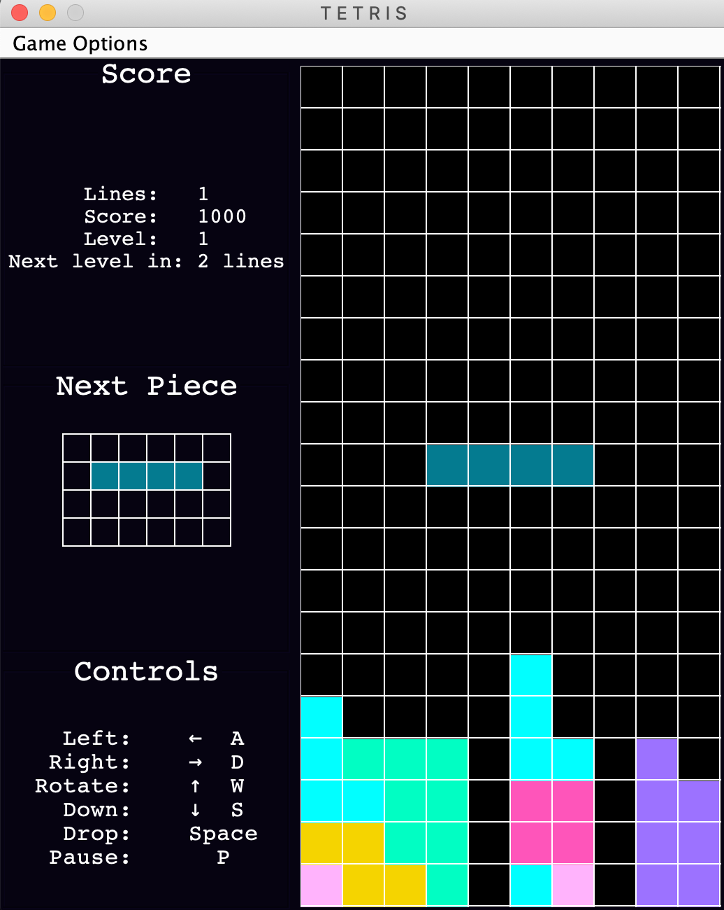

# tetris

A Java version of the classic Tetris from 1984. Created as a class assignment for TCSS 305.

To Run:
To load the Tetris game, please go into the view folder and press on the Main class. This will allow you to reach the 
main method which loads the game.

